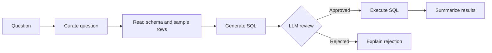

# Data Agent

**Ask questions about ride-share data in plain English and get database-backed answers.** Data Agent is a Python proof of concept that uses LangGraph, Groq-hosted language models, and PostgreSQL to turn a natural-language question into SQL, review the proposed query, execute it, and summarize the result.

> Portfolio project by [@rohitlonkar2006](https://github.com/rohitlonkar2006). Built to explore LLM orchestration, structured model output, and natural-language access to relational data.

## Why This Project

Business questions often require someone to know a database schema and write SQL. This project explores a conversational interface for querying a sample ride-share database, while making the query-generation and review steps explicit in a graph workflow.

## Features

- Natural-language question curation and SQL generation
- PostgreSQL schema and sample-row context supplied to the SQL-generation step
- Structured safety-review output validated with Pydantic
- Separate graph paths for approved and rejected queries
- Natural-language summaries of query results
- Reproducible CSV data for a realistic, relational ride-share example

## Workflow



The graph is implemented in `agents/sql_analyst.py`. Its state and the review response are defined in `models/schema.py`; `utils/llm_pick.py` configures the Groq models.

## Tech Stack

| Area | Technology |
| --- | --- |
| Language | Python 3.13+ |
| Workflow orchestration | LangGraph |
| LLM integration | LangChain and ChatGroq |
| Structured validation | Pydantic |
| Database | PostgreSQL with psycopg2 |
| Configuration | python-dotenv-compatible `.env` loading |

## Getting Started

### Prerequisites

- Python 3.13 or later
- PostgreSQL and a database you can use for this project
- A Groq API key

### Installation

Create and activate a virtual environment from the repository root:

```powershell
python -m venv .venv
.venv\Scripts\Activate.ps1
```

Install dependencies:

```powershell
python -m pip install -r requirements.txt
```

Create a `.env` file in the repository root:

```dotenv
GROQ_API_KEY=your_groq_api_key
host=localhost
port=5432
database=your_database_name
user=your_postgres_user
password=your_postgres_password
```

The database specified by `database` must already exist. Do not commit `.env` or share its credentials.

### Load the Sample Database

The sample CSV files are included in `data/`. From the repository root, create the tables and import the data with:

```powershell
python feed_db.py
```

To regenerate the deterministic CSV files first, run:

```powershell
python generate_data.py
```

> **Warning:** `feed_db.py` truncates the project's five tables with `CASCADE` before loading the CSVs. Use a disposable development database, not a database containing data you need.

## Ask a Question

The current runnable example is at the bottom of `agents/sql_analyst.py`. Change its `user_question` value and run:

```powershell
python agents/sql_analyst.py
```

To invoke the graph from another Python script, provide all fields required by `AgentSchema` and read the final answer from the returned state:

```python
from agents.sql_analyst import final_graph

result = final_graph.invoke(
	 {
		  "messages": [],
		  "user_question": "How many payment methods are in the database?",
		  "curated_question": "",
		  "prompt_query_context": "",
		  "generated_sql_query": "",
		  "is_safe_sql_response": "No",
		  "comments": "",
		  "sql_query_execution_result": "",
		  "final_answer": "",
	 }
)

print(result["final_answer"])
```

The initial safety value must be exactly `Yes` or `No`, including capitalization. It is replaced by the safety-review node during execution.

Example questions:

- How many rides were completed last month?
- What are the three most common payment methods?
- What is the average rating for each driver?

## Sample Dataset

| Table | Approx. rows | Contents |
| --- | ---: | --- |
| `users` | 10,000 | Rider and driver profiles |
| `vehicles` | 3,000 | Vehicles associated with drivers |
| `rides` | 20,000 | Requests, trip details, fares, and statuses |
| `payments` | 16,000 | Payment methods and transaction records |
| `ratings` | 12,000 | Ride ratings and comments |

`generate_data.py` uses a fixed random seed, making regenerated sample data repeatable.

## Engineering Notes

- **Graph-based orchestration:** curation, schema grounding, SQL generation, review, execution, and answer generation are distinct nodes.
- **Typed state:** Pydantic models define the state passed through the workflow and constrain the judge's answer to `Yes` or `No`.
- **Separate review outcomes:** the graph routes a rejected query to a response explaining why it was rejected, rather than executing it.
- **Local reproducible data:** the project includes a generator and PostgreSQL loader so the workflow can be explored without a real ride-share dataset.

## Limitations and Next Steps

This is a learning and portfolio project, not a production-ready database agent. The safety decision is made by an LLM and is not a security boundary. The repository currently has no automated test suite or interactive web interface; the example question is configured in the Python script.

Potential next steps:

- Add automated tests for graph routing, schema handling, and query execution.
- Add deterministic SQL validation and enforce read-only database permissions.
- Add a command-line interface for entering questions without editing source code.
- Add structured logging and clearer error handling for model and database failures.

## Security

- Use a dedicated PostgreSQL account with read-only permissions when running the agent. An LLM review can miss unsafe SQL.
- Do not connect this proof of concept to sensitive or production data.
- Keep Groq and database credentials in local environment configuration; never commit secrets.
- Run `feed_db.py` only against a disposable development database because it deletes existing rows from its target tables.

## Project Structure

```text
agents/sql_analyst.py   LangGraph text-to-SQL workflow
models/schema.py        Pydantic graph state and judge schemas
utils/llm_pick.py       Groq model configuration
utils/database.py      PostgreSQL schema inspection utilities
generate_data.py        Deterministic sample-data generator
feed_db.py              PostgreSQL table creation and CSV loader
data/                   Ride-share CSV dataset
```

## Maintainer

[@rohitlonkar2006 on GitHub](https://github.com/rohitlonkar2006)

No license is currently specified in this repository.
