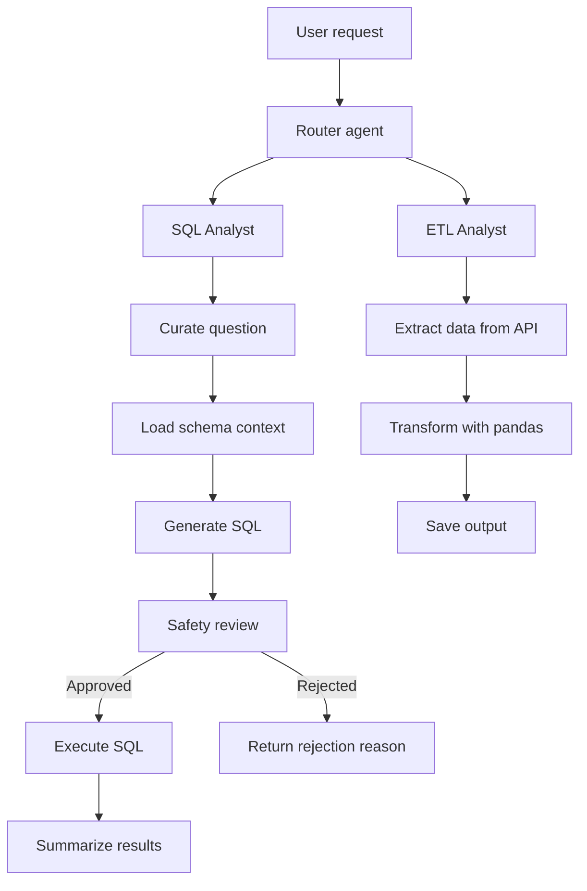

# Data Agent

Data Agent is an AI-powered data assistant that routes plain-English requests between a PostgreSQL SQL workflow and an ETL workflow. It uses LangGraph, LangChain, Groq-hosted LLMs, and Python tooling to interpret, validate, and execute tasks end-to-end.

> Portfolio project by [@rohitlonkar2006](https://github.com/rohitlonkar2006).

## Why This Project

Business questions often require both database access and data-processing skills. This project demonstrates a lightweight data-agent workflow that can:

- understand natural-language requests,
- route requests to the correct workflow,
- generate relevant SQL for a PostgreSQL database,
- check whether SQL is safe before execution,
- extract data from APIs and transform it with pandas,
- present results in a user-friendly interface.

## Features

- SQL question answering against a PostgreSQL database
- ETL workflow for API extraction and pandas transformation
- Request routing between SQL and ETL tasks
- LLM-based SQL safety review before execution
- Pydantic-validated state and structured agent responses
- Streamlit-based GUI for interactive use
- Deterministic sample data for ride-share analysis

## Architecture



## Project Structure

```text
agents/
  data_agent.py         Router that decides between SQL and ETL workflows
  etl_analyst.py        ETL agent with extraction and transformation tools
  sql_analyst.py        SQL workflow for query generation and execution
models/
  schema.py             Pydantic model definitions for agent state and routing
utils/
  database.py           PostgreSQL schema inspection and execution utilities
  etl_tools.py          ETL helper functions for API extraction and pandas logic
  llm_pick.py           Groq LLM selection by complexity level
data/
  extract/              Saved extracted files
  transform/            Saved transformed outputs
feed_db.py              PostgreSQL table creation and CSV loader
generate_data.py        Deterministic sample-data generator
main.py                 Streamlit GUI and app entry point
requirements.txt        Python dependencies
pyproject.toml          Project metadata and dependency configuration
```

## Tech Stack

| Area | Technology |
| --- | --- |
| Language | Python 3.13+ |
| Workflow orchestration | LangGraph |
| LLM integration | LangChain + ChatGroq |
| Structured validation | Pydantic |
| Database | PostgreSQL with psycopg2 |
| ETL | pandas |
| UI | Streamlit |
| Configuration | python-dotenv-compatible `.env` loading |

## Getting Started

### Prerequisites

- Python 3.13 or later
- PostgreSQL database available locally or on a dev server
- Groq API key
- Optional: a browser to use the Streamlit interface

### Installation

From the repository root, create and activate a virtual environment:

```powershell
python -m venv .venv
.venv\Scripts\Activate.ps1
```

Install dependencies:

```powershell
python -m pip install -r requirements.txt
```

Create a `.env` file in the project root:

```dotenv
GROQ_API_KEY=your_groq_api_key
host=localhost
port=5432
database=your_database_name
user=your_postgres_user
password=your_postgres_password
```

The database named in `database` must already exist. Do not commit your `.env` file or share your credentials.

### Load the Ride-Share Sample Database

The sample CSV files are stored in `data/`. To create the tables and load the data:

```powershell
python feed_db.py
```

To regenerate the deterministic CSV files before loading them again:

```powershell
python generate_data.py
```

> Warning: `feed_db.py` truncates the target tables with `CASCADE` before importing data. Run it only against a disposable development database.

## Running the App

Start the interactive Streamlit UI from the repository root:

```powershell
streamlit run main.py
```

The app includes:

- a query box for SQL or ETL requests,
- routing mode selection,
- quick example prompts,
- recent request history,
- detailed SQL output and execution panels,
- ETL workflow results.

## Running the Agent Components Directly

### SQL workflow

The SQL example run is defined near the bottom of `agents/sql_analyst.py`:

```powershell
python agents/sql_analyst.py
```

### ETL workflow

The ETL example run is defined near the bottom of `agents/etl_analyst.py`:

```powershell
python agents/etl_analyst.py
```

### Routed multi-workflow agent

The router is implemented in `agents/data_agent.py` and decides whether a request should be handled by the SQL or ETL agent:

```powershell
python agents/data_agent.py
```

## Example Requests

- "How many rides were completed last month?"
- "What are the three most common payment methods?"
- "Extract data from https://pokeapi.co/api/v2/pokemon and save it in data/extract"
- "Transform the extracted data to show only Bulbasaur rows and save it in data/transform"

## Sample Dataset

The project includes a deterministic synthetic ride-share dataset designed to mirror a realistic relational schema.

| Table | Approx. rows | Contents |
| --- | ---: | --- |
| `users` | 10,000 | Rider and driver profiles |
| `vehicles` | 3,000 | Vehicles associated with drivers |
| `rides` | 20,000 | Requests, trip details, fares, and statuses |
| `payments` | 16,000 | Payment methods and transaction records |
| `ratings` | 12,000 | Ride ratings and comments |

`generate_data.py` uses a fixed random seed to make regenerated sample data repeatable.

## Security Notes

- Use a dedicated PostgreSQL user with read-only permissions when possible.
- Treat the LLM safety review as a helpful check, not a security boundary.
- Do not connect the project to sensitive or production data.
- Keep Groq and database credentials in local environment configuration and do not commit secrets.

## Maintainer

[@rohitlonkar2006 on GitHub](https://github.com/rohitlonkar2006)

This project is provided for learning and portfolio use. No explicit license is currently specified for this repository.