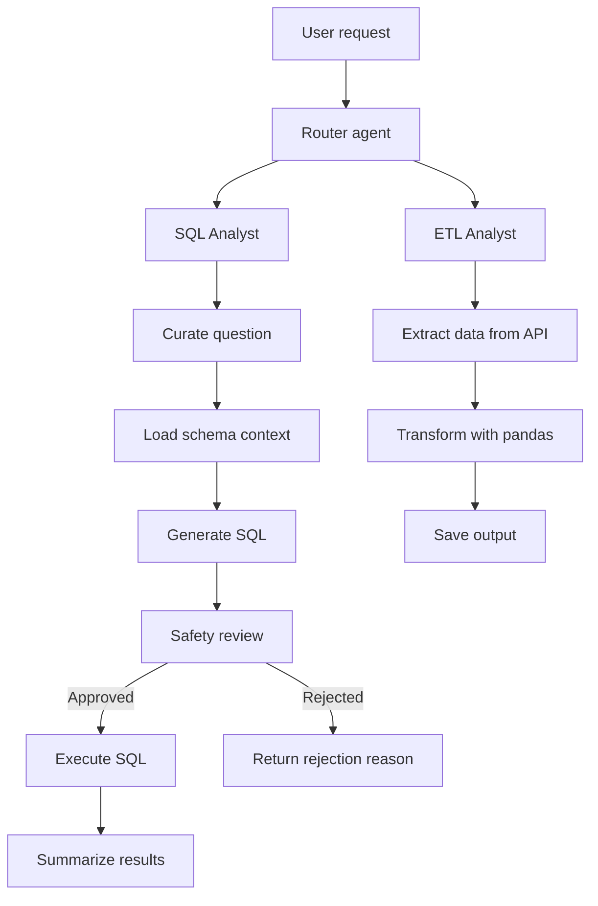

# Data Agent

Data Agent is an AI-powered data assistant that routes user requests between two workflows:

- SQL analysis for questions about data already stored in PostgreSQL
- ETL analysis for extraction, transformation, and loading tasks

Built with LangGraph, LangChain, Groq-hosted LLMs, and PostgreSQL, the project explores multimodal data workflows where an agent decides which path to take and executes the relevant task end-to-end.

> Portfolio project by [@rohitlonkar2006](https://github.com/rohitlonkar2006).

## Why This Project

Many business questions require both data access and data-processing skills. This project demonstrates a lightweight data agent that:

- understands natural-language requests,
- decides whether the task is SQL or ETL,
- uses schemas and sample data to generate valid SQL,
- validates unsafe SQL before execution,
- extracts data from APIs and transforms it with pandas when needed.

## Features

- Request routing between SQL and ETL tasks
- SQL analyst workflow using PostgreSQL schema context
- LLM-based SQL safety review before execution
- Structured state validation with Pydantic
- ETL workflow with API extraction and pandas transformation
- Output saved to CSV/JSON-style data folders
- Reproducible ride-share sample dataset for SQL experiments

## Architecture



Core implementation files:

- `agents/data_agent.py` - router that decides whether to use ETL or SQL
- `agents/sql_analyst.py` - SQL generation, safety check, execution, summarization
- `agents/etl_analyst.py` - ETL task orchestration with tools
- `models/schema.py` - Pydantic state schemas
- `utils/llm_pick.py` - Groq model selection
- `utils/database.py` - PostgreSQL schema inspection and execution utilities

## Tech Stack

| Area | Technology |
| --- | --- |
| Language | Python 3.13+ |
| Workflow orchestration | LangGraph |
| LLM integration | LangChain + ChatGroq |
| Structured validation | Pydantic |
| Database | PostgreSQL with psycopg2 |
| ETL | pandas |
| Configuration | python-dotenv-compatible `.env` loading |

## Getting Started

### Prerequisites

- Python 3.13 or later
- PostgreSQL database available locally or on a dev server
- Groq API key

### Installation

From the repository root, create and activate a virtual environment:

```powershell
python -m venv .venv
.venv\Scripts\Activate.ps1
```

Install dependencies:

```powershell
python -m pip install -r requirements.txt
```

Create a `.env` file in the project root:

```dotenv
GROQ_API_KEY=your_groq_api_key
host=localhost
port=5432
database=your_database_name
user=your_postgres_user
password=your_postgres_password
```

The database named in `database` must already exist. Do not commit your `.env` file or share credentials.

### Load the Ride-Share Sample Database

The sample CSV files are stored in `data/`. To create the tables and load the data:

```powershell
python feed_db.py
```

To regenerate the deterministic CSV files before loading them again:

```powershell
python generate_data.py
```

> Warning: `feed_db.py` truncates the target tables with `CASCADE` before importing data. Only run it against a disposable development database.

## Running the Agent

### SQL workflow

The SQL example run is defined near the bottom of `agents/sql_analyst.py`:

```powershell
python agents/sql_analyst.py
```

### ETL workflow

The ETL example run is defined near the bottom of `agents/etl_analyst.py`:

```powershell
python agents/etl_analyst.py
```

### Routed multi-workflow agent

The router is implemented in `agents/data_agent.py` and decides whether to send a request to the SQL or ETL agent:

```powershell
python agents/data_agent.py
```

Example natural-language requests:

- "How many rides were completed last month?"
- "What are the three most common payment methods?"
- "Extract data from https://pokeapi.co/api/v2/pokemon and save it in data/extract"
- "Transform the extracted data to show only Bulbasaur rows and save the output"

## Sample Dataset

The project includes a deterministic synthetic ride-share dataset that mirrors a realistic relational schema.

| Table | Approx. rows | Contents |
| --- | ---: | --- |
| `users` | 10,000 | Rider and driver profiles |
| `vehicles` | 3,000 | Vehicles associated with drivers |
| `rides` | 20,000 | Requests, trip details, fares, and statuses |
| `payments` | 16,000 | Payment methods and transaction records |
| `ratings` | 12,000 | Ride ratings and comments |

`generate_data.py` uses a fixed random seed to make regenerated data repeatable.

## Security Notes

- Use a dedicated PostgreSQL user with read-only permissions when possible.
- Treat the LLM safety review as a helpful check, not a security boundary.
- Do not connect the project to sensitive or production data.
- Keep Groq and database credentials in local environment configuration and do not commit secrets.

## Project Structure

```text
agents/
  data_agent.py         Router that decides between ETL and SQL workflows
  etl_analyst.py        ETL agent with extraction and transformation tools
  sql_analyst.py        SQL agent for question-to-query and execution
models/
  schema.py             Pydantic schemas for graph state and validation
utils/
  database.py           PostgreSQL utilities for schema inspection and execution
  etl_tools.py          ETL helper functions for API extraction and pandas ops
  llm_pick.py           Groq LLM configuration by complexity level
data/
  extract/              API extraction outputs
  transform/            Transformed data outputs
feed_db.py              PostgreSQL table creation and CSV loader
generate_data.py        Deterministic sample-data generator
main.py                 Project entry stub
requirements.txt        Python dependencies
pyproject.toml          Project metadata and dependency config
```

## Maintainer

[@rohitlonkar2006 on GitHub](https://github.com/rohitlonkar2006)

No explicit license is currently specified for this repository.
